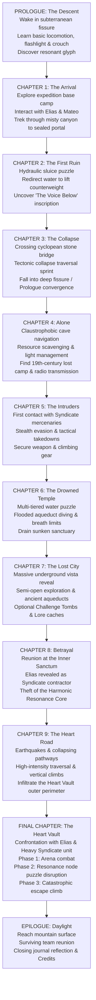

# MISSION FLOW & PROGRESSION GRAPH: ECHOES BENEATH

```mermaid
flowchart TD
    M0[PROLOGUE: The Descent\nWake in subterranean fissure\nLearn basic locomotion, flashlight & crouch\nDiscover resonant glyph] --> M1[CHAPTER 1: The Arrival\nExplore expedition base camp\nInteract with Elias & Mateo\nTrek through misty canyon to sealed portal]
    M1 --> M2[CHAPTER 2: The First Ruin\nHydraulic sluice puzzle\nRedirect water to lift counterweight\nUncover 'The Voice Below' inscription]
    M2 --> M3[CHAPTER 3: The Collapse\nCrossing cyclopean stone bridge\nTectonic collapse traversal sprint\nFall into deep fissure / Prologue convergence]
    M3 --> M4[CHAPTER 4: Alone\nClaustrophobic cave navigation\nResource scavenging & light management\nFind 19th-century lost camp & radio transmission]
    M4 --> M5[CHAPTER 5: The Intruders\nFirst contact with Syndicate mercenaries\nStealth evasion & tactical takedowns\nSecure weapon & climbing gear]
    M5 --> M6[CHAPTER 6: The Drowned Temple\nMulti-tiered water puzzle\nFlooded aqueduct diving & breath limits\nDrain sunken sanctuary]
    M6 --> M7[CHAPTER 7: The Lost City\nMassive underground vista reveal\nSemi-open exploration & ancient aqueducts\nOptional Challenge Tombs & Lore caches]
    M7 --> M8[CHAPTER 8: Betrayal\nReunion at the Inner Sanctum\nElias revealed as Syndicate contractor\nTheft of the Harmonic Resonance Core]
    M8 --> M9[CHAPTER 9: The Heart Road\nEarthquakes & collapsing pathways\nHigh-intensity traversal & vertical climbs\nInfiltrate the Heart Vault outer perimeter]
    M9 --> M10[FINAL CHAPTER: The Heart Vault\nConfrontation with Elias & Heavy Syndicate unit\nPhase 1: Arena combat\nPhase 2: Resonance node puzzle disruption\nPhase 3: Catastrophic escape climb]
    M10 --> M11[EPILOGUE: Daylight\nReach mountain surface\nSurviving team reunion\nClosing journal reflection & Credits]
```
